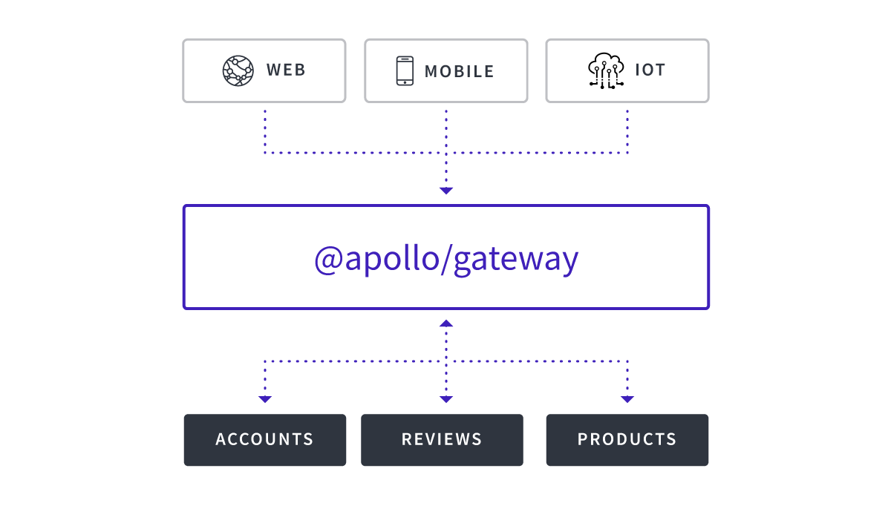

# Apollo Federation & Gateway

An [implementing service](https://www.apollographql.com/docs/apollo-server/federation/implementing-services/) is a GraphQL schema that confirms to the [Apollo Federation specification](https://www.apollographql.com/docs/apollo-server/federation/federation-spec/). These services can then be composed into a single schema using [Apollo Gateway](https://www.apollographql.com/docs/apollo-server/federation/gateway/), exposing a [single data graph](https://principledgraphql.com/integrity#1-one-graph) while enabling [concern-based separation](https://www.apollographql.com/docs/apollo-server/federation/introduction/#concern-based-separation) of types and fields across multiple services.  
  
In a federated schema, an [entity](https://www.apollographql.com/docs/apollo-server/federation/entities) is an object type with its primary keys appropriately [defined](https://www.apollographql.com/docs/apollo-server/federation/entities/#defining). Another service can then [reference](https://www.apollographql.com/docs/apollo-server/federation/entities/#referencing) that entity, or [extend](https://www.apollographql.com/docs/graphql-tools/generate-schema/#extending-types) it with additional fields to be provided when that entity is queried.

This guide will overview this [example](https://github.com/neo4j-graphql/neo4j-graphql-js/tree/master/example/apollo-federation), based on the Apollo Federation [demo](https://github.com/apollographql/federation-demo), to show current behavior and support.

1. show [article](https://www.apollographql.com/blog/apollo-federation-f260cf525d21) instructions for cloning the repo, then npm install npm run start-gateway

[https://www.apollographql.com/blog/apollo-federation-f260cf525d21](https://www.apollographql.com/blog/apollo-federation-f260cf525d21)

  

### Defining

### Referencing

first example extends product into reviews and adds Review.product, link to the example

### Extending

